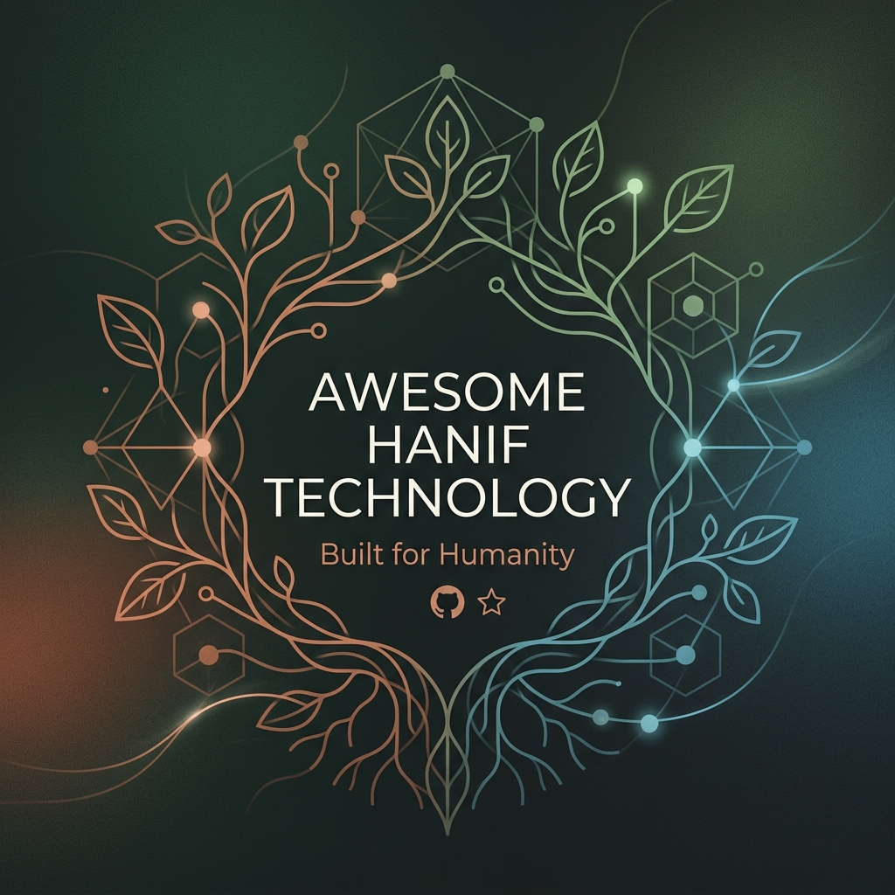

  

    

  # 🌿 Awesome-Hanif-Technology (AHT-List)

  
  
  
  

  > *"İnsanın, doğanın fıtratına, dünyanın eko sistemine zarar veren bir teknoloji hanif değildir. Hanif olan bir şey zarar vermez, yakmaz, yıkmaz. Hanif teknoloji fıtrata uyumlu sonuçlar üreten teknolojidir."*

**Awesome-Hanif-Technology**, GitHub ekosistemindeki meşhur "Awesome" listelerinin fıtrat ve erdem odaklı, yüksek yoğunluklu bir versiyonudur. Bu repo, dünyada insana, iradeye ve ekosisteme zarar vermeden geliştirilen teknolojilerin, algoritmaların, araçların ve açık kaynak projelerin küratörlüğünün yapıldığı bir **Hanif Teknoloji Bilgi Bankasıdır.**

Dataizm'in (her şeyi veriye indirgeyen sistem) ve küresel teknoloji tröstlerinin ürettiği; bağımlılık yapıcı, çevreyi tüketen ve gerçeklik algısını büken "modern" teknolojiye karşı, dokunulabilir hayatı ve "Ademiyet'i" savunan alternatiflerin listesidir.

---

## 📑 İçindekiler (Table of Contents)
- [Kabul Kriterleri (The Hanif Test)](#kabul-kriterleri-the-hanif-test)
- [Küratörlü Kategoriler (Curated Categories)](#küratörlü-kategoriler-curated-categories)
  - [Bilişsel Ergonomi ve İrade Koruması](#1-🧠-bilişsel-ergonomi-ve-irade-koruması-humane-tech)
  - [Ekolojik ve Uç Bilişim](#2-🍃-ekolojik-ve-uç-bilişim-green--edge-computing)
  - [Hanif Tarım ve Fiziksel Çapalar](#3-🌾-hanif-tarım-ve-fiziksel-çapalar-agri-tech--autonomy)
  - [Merkeziyetsiz ve Fıtri İletişim](#4-🌐-merkeziyetsiz-ve-fıtri-i̇letişim-decentralized-darusselam)
  - [Etik Yapay Zeka ve Algoritmalar](#5-🤖-etik-yapay-zeka-ve-algoritmalar-ethics-ai)
- [Katkıda Bulunma (How to Contribute)](#katkıda-bulunma-how-to-contribute)
- [Vizyon (The Call)](#vizyon-the-call)

---

## ⚖️ Kabul Kriterleri (The Hanif Test)

Bir projenin, kütüphanenin veya uygulamanın bu "Awesome" listesine girebilmesi için şu **4 testten** geçmesi zorunludur:

1. **Bağımsızlık (Anti-Addiction):** Kullanıcıyı sisteme bağımlı yapmaz. İradesini zayıflatmaz. İşi bittiğinde seni sistemden çıkmaya teşvik eder *(Sonsuz kaydırma / infinite scroll kesinlikle yasaktır).*
2. **Zararsızlık (Zero-Harm):** Cihazları kasıtlı olarak eskitmez (Planlı eskitme reddi). Çevresel zararı, karbon ayak izini ve sunucu (cloud) yükünü minimize eder. Donanım dostudur.
3. **Ahlaki Bütünlük (Moral Integrity):** Kullanıcıya sağladığı sözde "kolaylık" karşılığında, ondan ahlaki bir taviz istemez. Gizliliğini metalaştırmaz, verilerini manipülasyon veya rıza imalatı için kullanmaz.
4. **Dokunulabilirlik (Tangible Reality):** Seni dijital bir mağaraya hapsetmez; aksine gerçek dünya ile (toprak, aile, fiziksel üretim, lokal topluluklar) kurduğun bağı güçlendirir.

---

## 🏗️ Küratörlü Kategoriler (Curated Categories)

Her bir kategori, Hanif Testi geçmiş araçları derinlemesine inceleyen bağımsız listelerden oluşur.

### 1. 🧠 Bilişsel Ergonomi ve İrade Koruması (Humane Tech)
Kullanıcının dikkatini sömürmeyen, iradesini geri veren arayüzler ve sistemler.
> **[Detaylı Listeyi Gör ➡️](humane-tech.md)**
- Karanlık Desen (Dark Pattern) Engelleyiciler
- Dopamin-Dostu Başlatıcılar (Minimalist Launchers)
- Algoritmik Şeffaflık Filtreleri
- Dikkat ve Odak Araçları

### 2. 🍃 Ekolojik ve Uç Bilişim (Green & Edge Computing)
Doğayı tahrip eden devasa sunucu tarlaları yerine, yerelde ve fıtrata uygun çalışan mimariler.
> **[Detaylı Listeyi Gör ➡️](green-edge-computing.md)**
- Green-Edge-AI Modelleri
- Döngüsel Donanım (Right to Repair) İşletim Sistemleri
- Enerji Verimli Sunucu Araçları
- Karbon Ayak İzi İzleme Araçları

### 3. 🌾 Hanif Tarım ve Fiziksel Çapalar (Agri-Tech & Autonomy)
*Yusuf Personası'nın çizmesini giyip sahaya inmesi:* Dijital dünyadan fiziksel otonomiye geçiş.
> **[Detaylı Listeyi Gör ➡️](agri-tech-autonomy.md)**
- Akıllı Çiftlik Yönetim Sistemleri
- Tohum ve Genetik Kaynakları Yönetimi
- Su ve Sulama Yönetimi Aletleri
- Açık Kaynak Fiziksel Otonomi Donanımları
- Yerel Gıda Ağları

### 4. 🌐 Merkeziyetsiz ve Fıtri İletişim (Decentralized Darusselam)
Sermaye devlerinin iletişim tekelini kıran "Asa" teknolojileri ve eşler arası iletişim.
> **[Detaylı Listeyi Gör ➡️](decentralized-communication.md)**
- P2P (Noktadan Noktaya) Haberleşme Protokolleri
- Mesh Networks (Topluluk Destekli İnternet)
- Federe (Federated) Sosyal Ağlar
- Merkeziyetsiz Dosya Paylaşımı
- Gözetimsiz E-posta Alternatifleri

### 5. 🤖 Etik Yapay Zeka ve Algoritmalar (Ethics AI) **[YENİ]**
Manipülatif tavsiye motorlarına ve veri madenciliğine karşı insan iradesini koruyan modeller.
> **[Detaylı Listeyi Gör ➡️](ethics-ai-algorithms.md)**
- Veri Madenciliği Yapmayan LLM'ler
- Federative Learning (Federe Öğrenme) Araçları
- Açıklanabilir Yapay Zeka (XAI)
- Deepfake Tespit ve Gizlilik Koruma Filtreleri

---

## 🤝 Katkıda Bulunma (How to Contribute)

Bu liste, "beheriyetten ademiyete" (biyolojik canlıdan ahlaki insana) giden yolda insana engel değil, yardımcı olmak isteyen tüm mühendislerin, tasarımcıların ve düşünürlerin katkısına açıktır.

Lütfen formata ve standartlara uygunluk için [**Katkıda Bulunma Rehberi'ne (CONTRIBUTING.md)**](CONTRIBUTING.md) ile [**Davranış Kuralları'na (CODE_OF_CONDUCT.md)**](CODE_OF_CONDUCT.md) göz atın.

- Eğer bir teknoloji üretiyorsanız ve bu **"Hanif"** ise (yakmıyor, yıkmıyor, bağımlı yapmıyorsa) bir Pull Request (PR) açın.
- Eğer bir sistemin fıtrata aykırı çalıştığını (`Dataism Exploit`) tespit ettiyseniz, o sistemi etkisiz hale getirecek panzehir yazılımları bu listeye ekleyin.

---

## 📜 Vizyon (The Call)

> *"Kadim ifademizle Hanif teknoloji, bize beheriyetten ademiyete, insaniyete yolculuğumuzda engel değil yardımcı olan teknolojidir... Pratik düzlemde, dokunulabilir gerçeklik düzleminde tevhide davettir. Darüsselam'a davettir."*

Amacımız, bilimi ve teknolojiyi "teslim ol kurtul" anlayışından kurtarıp, insanın erdemi ve vicdanı için yeniden kodlamaktır. `printf("Bismillah");`

   
  Bu doküman, Hanif mühendisler tarafından fıtrata uyumlu teknoloji için üretilmiştir. 🌿

